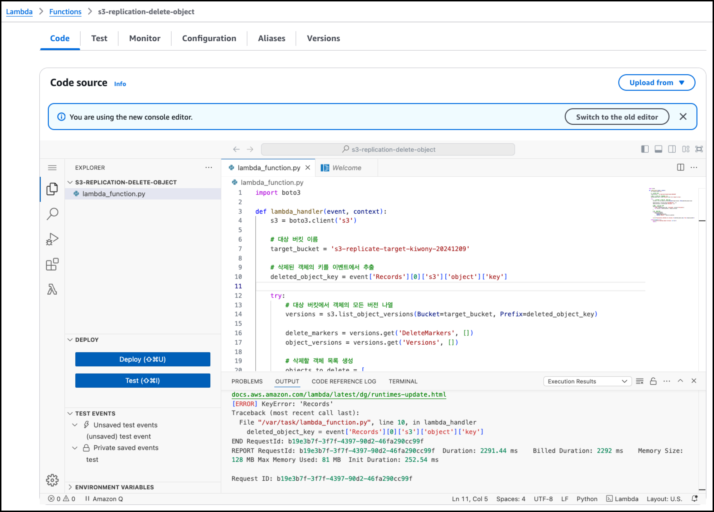

# S3 Replication by DataSync


### 3rd party solution에서 Versioning 상태의 Source S3 Bucket의 Object를 Permanent delete시 Replication이 걸려 있는 Target S3 Bucket에는 해당 Object가 삭제 되지 않는 문제에 대한 문의 


---

### 사전 준비

1. Source, Target Bucket Versioning Enable


2. 환경 변수 설정

```
(base) kiwony@kiwonymac.com:/Users/kiwony> SOURCE_BUCKET=s3-replicate-source-kiwony-20241209
(base) kiwony@kiwonymac.com:/Users/kiwony> TARGET_BUCKET=s3-replicate-target-kiwony-20241209
```


---

## Case 1 : S3 Replication : Versioning이 켜진 상태로 S3 Replication 상황에서 삭제 시 테스트


**테스트 결론 요약 : 1/ Versioning On, 2/ s3 replication이 켜진 상태**

**Source Bucket에서 a.txt 생성 시 Target에서도 수초 이내에 복제 수행**

**Source bucket의 a.txt가 삭제되면, Target Bucket에서도 a.txt 삭제 됨.**

**실제 object a.txt가 삭제 되면, a.txt에 해당하는 Delete Marker와 Inactive Object가 Source에 생성되고, Target으로 복제 **

**Source에서 a.txt의 Delete Marker와 inactive object를 삭제해도 Target Bucket에는 DM과 IN가 삭제되지 않고 계속 존재**


1. **S3 Replication 설정 - Create Replication Rule**


---

2. **Create Replication Rule**


---

3. **Replicate existing objects=No**


---

4. **Source Bucket에 object a.txt copy 후 확인**

```
(base) kiwony@kiwonymac.com:/Users/kiwony> aws s3 cp a.txt s3://s3-replicate-source-kiwony-20241209/
upload: ./a.txt to s3://s3-replicate-source-kiwony-20241209/a.txt

(base) kiwony@kiwonymac.com:/Users/kiwony> aws s3 ls s3://$SOURCE_BUCKET/
2024-12-12 16:37:29       1900 a.txt
(base) kiwony@kiwonymac.com:/Users/kiwony> aws s3 ls s3://$TARGET_BUCKET/
2024-12-12 16:37:29       1900 a.txt
```


---

5. **일반적인 s3 object 삭제 시 Test : aws s3 rm Test**

**Source bucket에서 a.txt 삭제 시 Source bucket에서만 삭제 동작**

```
(base) kiwony@kiwonymac.com:/Users/kiwony> aws s3 rm s3://$SOURCE_BUCKET/a.txt
delete: s3://s3-replicate-source-kiwony-20241209/a.txt
(base) kiwony@kiwonymac.com:/Users/kiwony> aws s3 ls s3://$SOURCE_BUCKET/
(base) kiwony@kiwonymac.com:/Users/kiwony>
(base) kiwony@kiwonymac.com:/Users/kiwony> aws s3 ls s3://$TARGET_BUCKET/
(base) kiwony@kiwonymac.com:/Users/kiwony>

```


**Delete Marker와 Inactive object 조회**

```
(base) kiwony@kiwonymac.com:/Users/kiwony> aws s3api list-object-versions --bucket $SOURCE_BUCKET --prefix a.txt

{
    "Versions": [
        {
            "ETag": "\"e2d68d1d946af48b255555cacb0b066f\"",
            "Size": 1900,
            "StorageClass": "STANDARD",
            "Key": "a.txt",
            "VersionId": "RJmAbJ23Wj_8K2Km9yopJdaEwDbWE_OJ",
            "IsLatest": false,
            "LastModified": "2024-12-12T07:37:29.000Z",
            "Owner": {
                "ID": "73478f1106ef73c64360a9ba0f345f3e606c426aa9f6d15fe4d0421a048b78be"
            }
        }
    ],
    "DeleteMarkers": [
        {
            "Owner": {
                "ID": "73478f1106ef73c64360a9ba0f345f3e606c426aa9f6d15fe4d0421a048b78be"
            },
            "Key": "a.txt",
            "VersionId": "p4DMzyn.X58xg4T.AqLMvi877YTw0ivs",
            "IsLatest": true,
            "LastModified": "2024-12-12T07:41:14.000Z"
        }
    ],
    "RequestCharged": null,
    "Prefix": "a.txt"
}
(base) kiwony@kiwonymac.com:/Users/kiwony> aws s3api list-object-versions --bucket $TARGET_BUCKET --prefix a.txt

{
    "Versions": [
        {
            "ETag": "\"e2d68d1d946af48b255555cacb0b066f\"",
            "Size": 1900,
            "StorageClass": "STANDARD",
            "Key": "a.txt",
            "VersionId": "RJmAbJ23Wj_8K2Km9yopJdaEwDbWE_OJ",
            "IsLatest": false,
            "LastModified": "2024-12-12T07:37:29.000Z",
            "Owner": {
                "ID": "73478f1106ef73c64360a9ba0f345f3e606c426aa9f6d15fe4d0421a048b78be"
            }
        }
    ],
    "DeleteMarkers": [
        {
            "Owner": {
                "ID": "73478f1106ef73c64360a9ba0f345f3e606c426aa9f6d15fe4d0421a048b78be"
            },
            "Key": "a.txt",
            "VersionId": "p4DMzyn.X58xg4T.AqLMvi877YTw0ivs",
            "IsLatest": true,
            "LastModified": "2024-12-12T07:41:14.000Z"
        }
    ],
    "RequestCharged": null,
    "Prefix": "a.txt"
}
```


---

6. **Source Bucket에서 Delete Marker와 Inactive Object 삭제 Test**

**delete marker 삭제**

```
(base) kiwony@kiwonymac.com:/Users/kiwony> aws s3api delete-object --bucket $SOURCE_BUCKET --key a.txt --version-id $(aws s3api list-object-versions --bucket $SOURCE_BUCKET --prefix a.txt --query 'DeleteMarkers[].VersionId' --output text)
{
    "DeleteMarker": true,
    "VersionId": "p4DMzyn.X58xg4T.AqLMvi877YTw0ivs"
}
```

**Inactive Object 삭제**

```
(base) kiwony@kiwonymac.com:/Users/kiwony> aws s3api delete-object --bucket $SOURCE_BUCKET --key a.txt --version-id $(aws s3api list-object-versions --bucket $SOURCE_BUCKET --prefix a.txt --query 'Versions[].VersionId' --output text)
{
    "VersionId": "RJmAbJ23Wj_8K2Km9yopJdaEwDbWE_OJ"
}
```

**Source bucket에서 a.txt 조회 결과**

```
(base) kiwony@kiwonymac.com:/Users/kiwony> aws s3api list-object-versions --bucket $SOURCE_BUCKET --prefix a.txt
{
    "RequestCharged": null,
    "Prefix": "a.txt"
}
```

**Target Bucket에서 a.txt 조회 결과 : a.txt의 Delete Marker와 Inactive Object는 삭제 되지 않음**

```
(base) kiwony@kiwonymac.com:/Users/kiwony> aws s3api list-object-versions --bucket $TARGET_BUCKET --prefix a.txt
{
    "Versions": [
        {
            "ETag": "\"e2d68d1d946af48b255555cacb0b066f\"",
            "Size": 1900,
            "StorageClass": "STANDARD",
            "Key": "a.txt",
            "VersionId": "RJmAbJ23Wj_8K2Km9yopJdaEwDbWE_OJ",
            "IsLatest": false,
            "LastModified": "2024-12-12T07:37:29.000Z",
            "Owner": {
                "ID": "73478f1106ef73c64360a9ba0f345f3e606c426aa9f6d15fe4d0421a048b78be"
            }
        }
    ],
    "DeleteMarkers": [
        {
            "Owner": {
                "ID": "73478f1106ef73c64360a9ba0f345f3e606c426aa9f6d15fe4d0421a048b78be"
            },
            "Key": "a.txt",
            "VersionId": "p4DMzyn.X58xg4T.AqLMvi877YTw0ivs",
            "IsLatest": true,
            "LastModified": "2024-12-12T07:41:14.000Z"
        }
    ],
    "RequestCharged": null,
    "Prefix": "a.txt"
}
```


7. **Target Bucket에 남아있는 Delete Marker와 Inactive Object 삭제 Test**

```
(base) kiwony@kiwonymac.com:/Users/kiwony> aws s3api delete-object --bucket $TARGET_BUCKET --key a.txt --version-id $(aws s3api list-object-versions --bucket $TARGET_BUCKET --prefix a.txt --query 'DeleteMarkers[].VersionId' --output text)
{
    "DeleteMarker": true,
    "VersionId": "p4DMzyn.X58xg4T.AqLMvi877YTw0ivs"
}
```


```
(base) kiwony@kiwonymac.com:/Users/kiwony> aws s3api delete-object --bucket $TARGET_BUCKET --key a.txt --version-id $(aws s3api list-object-versions --bucket $TARGET_BUCKET --prefix a.txt --query 'Versions[].VersionId' --output text)
{
    "VersionId": "RJmAbJ23Wj_8K2Km9yopJdaEwDbWE_OJ"
}
```


```
(base) kiwony@kiwonymac.com:/Users/kiwony> aws s3api list-object-versions --bucket $TARGET_BUCKET --prefix a.txt
{
    "RequestCharged": null,
    "Prefix": "a.txt"
}
```


---

### 2. Case 2 DataSync : Versioning이 켜진 상태로 DataSync One-Way 복제 사용시 삭제 시 테스트(일반 삭제 기준)

**테스트 결론 요약 : 1/ Versioning On, 2/ DataSync replication이 켜진 상태**

**Source Bucket에서 a.txt 생성 후, DataSync Task 실행 후 Target에서도 수초 이내에 복제 수행**

**Source bucket의 a.txt가 삭제 후,  DataSync Task 실행 후 Target Bucket에서도 a.txt 삭제 됨.**

**실제 object a.txt가 삭제 되면, a.txt에 해당하는 Delete Marker와 Inactive Object가 Source에 생성되고,  DataSync Task 실행 후 Target으로 복제 **

**Source에서 a.txt의 Delete Marker와 inactive object를 삭제 후,  DataSync Task 실행 해도 Target Bucket에는 DM과 IN가 삭제되지 않고 계속 존재**


1. **DataSync 복제 설정**

**Source Location 설정**


```
{
    "Version": "2012-10-17",
    "Statement": [
        {
            "Sid": "AWSDataSyncS3BucketPermissions",
            "Effect": "Allow",
            "Action": [
                "s3:GetBucketLocation",
                "s3:ListBucket",
                "s3:ListBucketMultipartUploads"
            ],
            "Resource": "arn:aws:s3:::s3-replicate-source-kiwony-20241209",
            "Condition": {
                "StringEquals": {
                    "aws:ResourceAccount": "123456789012"
                }
            }
        },
        {
            "Sid": "AWSDataSyncS3ObjectPermissions",
            "Effect": "Allow",
            "Action": [
                "s3:AbortMultipartUpload",
                "s3:DeleteObject",
                "s3:GetObject",
                "s3:GetObjectTagging",
                "s3:GetObjectVersion",
                "s3:GetObjectVersionTagging",
                "s3:ListMultipartUploadParts",
                "s3:PutObject",
                "s3:PutObjectTagging"
            ],
            "Resource": "arn:aws:s3:::s3-replicate-source-kiwony-20241209/*",
            "Condition": {
                "StringEquals": {
                    "aws:ResourceAccount": "123456789012"
                }
            }
        }
    ]
}
```


**Target Location 설정**


**Configure Settings**


**AWSDataSyncTaskReportS3BucketAccess-datasync-report-kiwony-a5505**

```
{
    "Version": "2012-10-17",
    "Statement": [
        {
            "Action": [
                "s3:PutObject"
            ],
            "Effect": "Allow",
            "Resource": "arn:aws:s3:::datasync-report-kiwony/*",
            "Condition": {
                "StringEquals": {
                    "s3:ResourceAccount": "123456789012"
                }
            }
        }
    ]
}
```


---

2. **Source Bucket에 object a.txt copy 후 확인 - DataSync이기 때문에 Target으로 자동 전송 안됨.** 

```
(base) kiwony@kiwonymac.com:/Users/kiwony> aws s3 cp a.txt s3://s3-replicate-source-kiwony-20241209/
upload: ./a.txt to s3://s3-replicate-source-kiwony-20241209/a.txt
(base) kiwony@kiwonymac.com:/Users/kiwony> aws s3 ls s3://$SOURCE_BUCKET/
2024-12-13 18:05:24       1900 a.txt
(base) kiwony@kiwonymac.com:/Users/kiwony> aws s3 ls s3://$TARGET_BUCKET/
(base) kiwony@kiwonymac.com:/Users/kiwony>
```


---

3. **datasync task 실행**

```
(base) kiwony@kiwonymac.com:/Users/kiwony> aws datasync start-task-execution --task-arn arn:aws:datasync:ap-northeast-2:664695030410:task/task-02b7f7e2c1f1b1370
{
    "TaskExecutionArn": "arn:aws:datasync:ap-northeast-2:664695030410:task/task-02b7f7e2c1f1b1370/execution/exec-0bc08d054f39be4db"
}

(base) kiwony@kiwonymac.com:/Users/kiwony> aws s3 ls s3://$TARGET_BUCKET/
2024-12-13 19:17:38       1900 a.txt
```


**DataSync Log**

```
{
  "AccountId": "664695030410",
  "TaskExecutionId": "exec-0bc08d054f39be4db",
  "TaskMode": "ENHANCED",
  "SourceLocation": {
    "LocationType": "Amazon S3",
    "LocationId": "loc-0997824a5a0bca2aa",
    "CreationTime": "2024-12-13T08:59:39.565Z"
  },
  "DestinationLocation": {
    "LocationType": "Amazon S3",
    "LocationId": "loc-09ad2175b5cdc7069",
    "CreationTime": "2024-12-13T08:59:39.697Z"
  },
  "StartTime": "2024-12-13T10:14:31.781Z",
  "EndTime": "2024-12-13T10:14:36.847Z",
  "TotalTime": 5066,
  "OverallStatus": "SUCCESS",
  "Result": {
    "FilesTransferred": 1,
    "FilesDeleted": 0,
    "FilesVerified": 1,
    "FilesSkipped": 0,
    "BytesWritten": 1900,
    "BytesTransferred": 1900,
    "BytesCompressed": 1900,
    "EstimatedBytesToTransfer": 1900,
    "EstimatedFilesToDelete": 0,
    "EstimatedFilesToTransfer": 1,
    "FilesPrepared": 1,
    "FilesListed": {
      "AtSource": 1,
      "AtDestinationForDelete": 0
    },
    "FilesFailed": {
      "Prepare": 0,
      "Transfer": 0,
      "Verify": 0,
      "Delete": 0
    },
    "PrepareDuration": 0,
    "PrepareStatus": "SUCCESS",
    "TransferDuration": 0,
    "TransferStatus": "SUCCESS",
    "VerifyDuration": 0,
    "VerifyStatus": "SUCCESS"
  },
  "Options": {
    "VerifyMode": "ONLY_FILES_TRANSFERRED",
    "OverwriteMode": "ALWAYS",
    "Atime": "BEST_EFFORT",
    "Mtime": "PRESERVE",
    "Uid": "NONE",
    "Gid": "NONE",
    "PreserveDeletedFiles": "REMOVE",
    "PreserveDevices": "NONE",
    "PosixPermissions": "NONE",
    "BytesPerSecond": -1,
    "TaskQueueing": "ENABLED",
    "LogLevel": "TRANSFER",
    "TransferMode": "CHANGED",
    "SecurityDescriptorCopyFlags": "NONE",
    "ObjectTags": "PRESERVE"
  },
  "Filters": {
    "Includes": [],
    "Excludes": []
  },
  "TaskReportConfig": {
    "Destination": {
      "S3": {
        "S3BucketArn": "arn:aws:s3:::datasync-report-kiwony",
        "BucketAccessRoleArn": "arn:aws:iam::664695030410:role/service-role/AWSDataSyncTaskReportS3BucketAccess-datasync-report-kiwony-a5505"
      }
    },
    "OutputType": "STANDARD",
    "ReportLevel": "ERRORS_ONLY",
    "ObjectVersionIds": "INCLUDE"
  }
}
```


---

4. **일반적인 s3 object 삭제 시 Test : aws s3 rm Test**

**Source bucket에서 a.txt 삭제 시 Target bucket에서는 object 변화 없음**

```
(base) kiwony@kiwonymac.com:/Users/kiwony> aws s3 rm s3://$SOURCE_BUCKET/a.txt
delete: s3://s3-replicate-source-kiwony-20241209/a.txt
(base) kiwony@kiwonymac.com:/Users/kiwony> aws s3 ls s3://$SOURCE_BUCKET/
(base) kiwony@kiwonymac.com:/Users/kiwony> aws s3 ls s3://$TARGET_BUCKET/
2024-12-13 19:17:38       1900 a.txt
```


**Delete Marker와 Inactive object 조회**

```
(base) kiwony@kiwonymac.com:/Users/kiwony> aws s3api list-object-versions --bucket $SOURCE_BUCKET --prefix a.txt
{
    "Versions": [
        {
            "ETag": "\"e2d68d1d946af48b255555cacb0b066f\"",
            "Size": 1900,
            "StorageClass": "STANDARD",
            "Key": "a.txt",
            "VersionId": "Rv8cTu7mxKnbJ5aeXMi8QDsq3rqStXe4",
            "IsLatest": false,
            "LastModified": "2024-12-13T09:05:24.000Z",
            "Owner": {
                "ID": "73478f1106ef73c64360a9ba0f345f3e606c426aa9f6d15fe4d0421a048b78be"
            }
        }
    ],
    "DeleteMarkers": [
        {
            "Owner": {
                "ID": "73478f1106ef73c64360a9ba0f345f3e606c426aa9f6d15fe4d0421a048b78be"
            },
            "Key": "a.txt",
            "VersionId": ".awUsETyoYuBvZdhjTgHKCSPGvkJi3EV",
            "IsLatest": true,
            "LastModified": "2024-12-13T10:18:49.000Z"
        }
    ],
    "RequestCharged": null,
    "Prefix": "a.txt"
}

(base) kiwony@kiwonymac.com:/Users/kiwony> aws s3api list-object-versions --bucket $TARGET_BUCKET --prefix a.txt

{
    "Versions": [
        {
            "ETag": "\"e2d68d1d946af48b255555cacb0b066f\"",
            "ChecksumAlgorithm": [
                "SHA256"
            ],
            "Size": 1900,
            "StorageClass": "STANDARD",
            "Key": "a.txt",
            "VersionId": "yiintlvR3RmWFkfSxFBJ5BF0lCYYZb9k",
            "IsLatest": true,
            "LastModified": "2024-12-13T10:17:38.000Z",
            "Owner": {
                "ID": "73478f1106ef73c64360a9ba0f345f3e606c426aa9f6d15fe4d0421a048b78be"
            }
        }
    ],
    "RequestCharged": null,
    "Prefix": "a.txt"
}
```


---

5. **datasync task 실행 - 동기화 실행되며 a.txt 삭제 완료**

```
(base) kiwony@kiwonymac.com:/Users/kiwony> aws datasync start-task-execution --task-arn arn:aws:datasync:ap-northeast-2:664695030410:task/task-02b7f7e2c1f1b1370
{
    "TaskExecutionArn": "arn:aws:datasync:ap-northeast-2:664695030410:task/task-02b7f7e2c1f1b1370/execution/exec-07ed5cae6cbf77361"
}

(base) kiwony@kiwonymac.com:/Users/kiwony> aws s3 ls s3://$TARGET_BUCKET/
(base) kiwony@kiwonymac.com:/Users/kiwony>
```


---

6. **Source Bucket에서 Delete Marker와 Inactive Object 삭제 Test**

**delete marker 삭제**

```
(base) kiwony@kiwonymac.com:/Users/kiwony> aws s3api delete-object --bucket $SOURCE_BUCKET --key a.txt --version-id $(aws s3api list-object-versions --bucket $SOURCE_BUCKET --prefix a.txt --query 'DeleteMarkers[].VersionId' --output text)
{
    "DeleteMarker": true,
    "VersionId": ".awUsETyoYuBvZdhjTgHKCSPGvkJi3EV"
}
```

**Inactive Object 삭제**

```
(base) kiwony@kiwonymac.com:/Users/kiwony> aws s3api delete-object --bucket $SOURCE_BUCKET --key a.txt --version-id $(aws s3api list-object-versions --bucket $SOURCE_BUCKET --prefix a.txt --query 'Versions[].VersionId' --output text)
{
    "VersionId": "Rv8cTu7mxKnbJ5aeXMi8QDsq3rqStXe4"
}
```

**Source bucket에서 a.txt 조회 결과**

```
(base) kiwony@kiwonymac.com:/Users/kiwony> aws s3api list-object-versions --bucket $SOURCE_BUCKET --prefix a.txt
{
    "RequestCharged": null,
    "Prefix": "a.txt"
}
```

**Target Bucket에서 a.txt 조회 결과 : a.txt의 Delete Marker와 Inactive Object는 삭제 되지 않음**

```
(base) kiwony@kiwonymac.com:/Users/kiwony> aws s3api list-object-versions --bucket $TARGET_BUCKET --prefix a.txt
{
    "Versions": [
        {
            "ETag": "\"e2d68d1d946af48b255555cacb0b066f\"",
            "ChecksumAlgorithm": [
                "SHA256"
            ],
            "Size": 1900,
            "StorageClass": "STANDARD",
            "Key": "a.txt",
            "VersionId": "yiintlvR3RmWFkfSxFBJ5BF0lCYYZb9k",
            "IsLatest": false,
            "LastModified": "2024-12-13T10:17:38.000Z",
            "Owner": {
                "ID": "73478f1106ef73c64360a9ba0f345f3e606c426aa9f6d15fe4d0421a048b78be"
            }
        }
    ],
    "DeleteMarkers": [
        {
            "Owner": {
                "ID": "73478f1106ef73c64360a9ba0f345f3e606c426aa9f6d15fe4d0421a048b78be"
            },
            "Key": "a.txt",
            "VersionId": "905Vx7.pKqxNIuSi1uYH8_.n_YE1hPPu",
            "IsLatest": true,
            "LastModified": "2024-12-13T10:24:18.000Z"
        }
    ],
    "RequestCharged": null,
    "Prefix": "a.txt"
}
```


---

7. **datasync task 실행 - 동기화 실행되었지만 Target bucket의 Delete marker와  Inactive object 그대로 존재**

```
(base) kiwony@kiwonymac.com:/Users/kiwony> aws datasync start-task-execution --task-arn arn:aws:datasync:ap-northeast-2:664695030410:task/task-02b7f7e2c1f1b1370
{
    "TaskExecutionArn": "arn:aws:datasync:ap-northeast-2:664695030410:task/task-02b7f7e2c1f1b1370/execution/exec-0635be18df2ca161f"
}

(base) kiwony@kiwonymac.com:/Users/kiwony> aws s3api list-object-versions --bucket $TARGET_BUCKET --prefix a.txt
{
    "Versions": [
        {
            "ETag": "\"e2d68d1d946af48b255555cacb0b066f\"",
            "ChecksumAlgorithm": [
                "SHA256"
            ],
            "Size": 1900,
            "StorageClass": "STANDARD",
            "Key": "a.txt",
            "VersionId": "yiintlvR3RmWFkfSxFBJ5BF0lCYYZb9k",
            "IsLatest": false,
            "LastModified": "2024-12-13T10:17:38.000Z",
            "Owner": {
                "ID": "73478f1106ef73c64360a9ba0f345f3e606c426aa9f6d15fe4d0421a048b78be"
            }
        }
    ],
    "DeleteMarkers": [
        {
            "Owner": {
                "ID": "73478f1106ef73c64360a9ba0f345f3e606c426aa9f6d15fe4d0421a048b78be"
            },
            "Key": "a.txt",
            "VersionId": "905Vx7.pKqxNIuSi1uYH8_.n_YE1hPPu",
            "IsLatest": true,
            "LastModified": "2024-12-13T10:24:18.000Z"
        }
    ],
    "RequestCharged": null,
    "Prefix": "a.txt"
}
```


---

## 3. S3 Replication에서 Delete marker replication=Disalbed


**1. S3 Replication Rule  설정- Delete marker replication 설정 안함** 


---

2. **Source Bucket에 object b.txt copy 후 확인**

```
(base) kiwony@kiwonymac.com:/Users/kiwony> aws s3 cp b.txt s3://s3-replicate-source-kiwony-20241209/
upload: ./b.txt to s3://s3-replicate-source-kiwony-20241209/b.txt

(base) kiwony@kiwonymac.com:/Users/kiwony> aws s3 ls s3://$SOURCE_BUCKET/
2024-12-13 22:55:32       1900 b.txt
(base) kiwony@kiwonymac.com:/Users/kiwony> aws s3 ls s3://$TARGET_BUCKET/
2024-12-13 22:55:32       1900 b.txt
```


---

5. **일반적인 s3 object 삭제 시 Test : aws s3 rm Test**

**Source bucket에서 b.txt 삭제 시 Source bucket에서만 삭제 동작하고 Target에서는 b.txt가 그대로 유지됨**

```
(base) kiwony@kiwonymac.com:/Users/kiwony> aws s3 rm s3://$SOURCE_BUCKET/b.txt
delete: s3://s3-replicate-source-kiwony-20241209/b.txt

(base) kiwony@kiwonymac.com:/Users/kiwony> aws s3 ls s3://$SOURCE_BUCKET/
(base) kiwony@kiwonymac.com:/Users/kiwony> aws s3 ls s3://$TARGET_BUCKET/
2024-12-13 22:55:32       1900 b.txt
```


---

## 4. S3 Replication과 Lambda를 활용한 방법 


**1. S3 Replication Rule  설정 - Delete Marker Replication 활성화**


---

2. **Lambda Function 생성**

```
import boto3

def lambda_handler(event, context):
    s3 = boto3.client('s3')
    
    # 대상 버킷 이름
    target_bucket = 's3-replicate-target-kiwony-20241209'
    
    # 삭제된 객체의 키를 이벤트에서 추출
    deleted_object_key = event['Records'][0]['s3']['object']['key']
    
    try:
        # 대상 버킷에서 객체의 모든 버전 나열
        versions = s3.list_object_versions(Bucket=target_bucket, Prefix=deleted_object_key)
        
        delete_markers = versions.get('DeleteMarkers', [])
        object_versions = versions.get('Versions', [])
        
        # 삭제할 객체 목록 생성
        objects_to_delete = [
            {'Key': deleted_object_key, 'VersionId': version['VersionId']}
            for version in delete_markers + object_versions
        ]
        
        # 모든 버전 삭제
        if objects_to_delete:
            s3.delete_objects(
                Bucket=target_bucket,
                Delete={'Objects': objects_to_delete}
            )
        
        print(f"Successfully deleted all versions of {deleted_object_key} from {target_bucket}")
    
    except Exception as e:
        print(f"Error deleting object versions: {str(e)}")
        raise e

```





---

3. **Event Notification 설정**

   **Object removal - Permanently deleted 선택, Lambda Function 선택**

   **Source Bucket에서 Original object를 삭제하면, S3 replication에 의해서 Target bucket에 반영되기 때문에 Delete marker와 Inactive Object만 lambda로 삭제하도록 함**


---

5. **Source Bucket에 object e.txt copy 후 확인**

```
(base) kiwony@kiwonymac.com:/Users/kiwony> aws s3 cp e.txt s3://s3-replicate-source-kiwony-20241209/
upload: ./e.txt to s3://s3-replicate-source-kiwony-20241209/e.txt

(base) kiwony@kiwonymac.com:/Users/kiwony> aws s3 ls s3://$SOURCE_BUCKET/
2024-12-14 20:34:04       1900 e.txt

(base) kiwony@kiwonymac.com:/Users/kiwony> aws s3 ls s3://$TARGET_BUCKET/
2024-12-14 20:34:04       1900 e.txt
```


6. **Source에서 e.txt 삭제 (Source 삭제 후 Replication에 의해 Target에서도 삭제**

```
(base) kiwony@kiwonymac.com:/Users/kiwony> aws s3 rm s3://$SOURCE_BUCKET/e.txt
delete: s3://s3-replicate-source-kiwony-20241209/e.txt
(base) kiwony@kiwonymac.com:/Users/kiwony> aws s3 ls s3://$SOURCE_BUCKET/
(base) kiwony@kiwonymac.com:/Users/kiwony> aws s3 ls s3://$TARGET_BUCKET/
(base) kiwony@kiwonymac.com:/Users/kiwony>
```


7. **Delete Marker와 Invalid Object 생성 확인**

```
(base) kiwony@kiwonymac.com:/Users/kiwony> aws s3api list-object-versions --bucket $SOURCE_BUCKET --prefix e.txt
{
    "Versions": [
        {
            "ETag": "\"e2d68d1d946af48b255555cacb0b066f\"",
            "Size": 1900,
            "StorageClass": "STANDARD",
            "Key": "e.txt",
            "VersionId": "JxTHCyoG9IwwnGSqDy4jRfEG.WW.d8sO",
            "IsLatest": false,
            "LastModified": "2024-12-14T11:34:04.000Z",
            "Owner": {
                "ID": "73478f1106ef73c64360a9ba0f345f3e606c426aa9f6d15fe4d0421a048b78be"
            }
        }
    ],
    "DeleteMarkers": [
        {
            "Owner": {
                "ID": "73478f1106ef73c64360a9ba0f345f3e606c426aa9f6d15fe4d0421a048b78be"
            },
            "Key": "e.txt",
            "VersionId": "A1bqZQB5cya39JW_f6v7vx33gOE66cVY",
            "IsLatest": true,
            "LastModified": "2024-12-14T11:35:13.000Z"
        }
    ],
    "RequestCharged": null,
    "Prefix": "e.txt"
}
```

```
(base) kiwony@kiwonymac.com:/Users/kiwony> aws s3api list-object-versions --bucket $TARGET_BUCKET --prefix e.txt
{
    "Versions": [
        {
            "ETag": "\"e2d68d1d946af48b255555cacb0b066f\"",
            "Size": 1900,
            "StorageClass": "STANDARD",
            "Key": "e.txt",
            "VersionId": "JxTHCyoG9IwwnGSqDy4jRfEG.WW.d8sO",
            "IsLatest": false,
            "LastModified": "2024-12-14T11:34:04.000Z",
            "Owner": {
                "ID": "73478f1106ef73c64360a9ba0f345f3e606c426aa9f6d15fe4d0421a048b78be"
            }
        }
    ],
    "DeleteMarkers": [
        {
            "Owner": {
                "ID": "73478f1106ef73c64360a9ba0f345f3e606c426aa9f6d15fe4d0421a048b78be"
            },
            "Key": "e.txt",
            "VersionId": "A1bqZQB5cya39JW_f6v7vx33gOE66cVY",
            "IsLatest": true,
            "LastModified": "2024-12-14T11:35:13.000Z"
        }
    ],
    "RequestCharged": null,
    "Prefix": "e.txt"
}
```


8. **Source Bucket에서 Delete Marker와 Invalid Object 삭제**

**delete marker 삭제**

```
(base) kiwony@kiwonymac.com:/Users/kiwony> aws s3api delete-object --bucket $SOURCE_BUCKET --key e.txt --version-id $(aws s3api list-object-versions --bucket $SOURCE_BUCKET --prefix e.txt --query 'DeleteMarkers[].VersionId' --output text)
{
    "DeleteMarker": true,
    "VersionId": "A1bqZQB5cya39JW_f6v7vx33gOE66cVY"
}
```

**Inactive Object 삭제**

```
(base) kiwony@kiwonymac.com:/Users/kiwony> aws s3api delete-object --bucket $SOURCE_BUCKET --key e.txt --version-id $(aws s3api list-object-versions --bucket $SOURCE_BUCKET --prefix e.txt --query 'Versions[].VersionId' --output text)
{
    "VersionId": "JxTHCyoG9IwwnGSqDy4jRfEG.WW.d8sO"
}
```

**Source bucket에서 a.txt 조회 결과**

```
(base) kiwony@kiwonymac.com:/Users/kiwony> aws s3api list-object-versions --bucket $SOURCE_BUCKET --prefix e.txt
{
    "RequestCharged": null,
    "Prefix": "e.txt"
}
```


9. **Target Bucket에서 object 및 Delete Marker등 조회**

```
(base) kiwony@kiwonymac.com:/Users/kiwony> aws s3api list-object-versions --bucket $TARGET_BUCKET --prefix e.txt
{
    "RequestCharged": null,
    "Prefix": "e.txt"
}
```


---

### 별첨 


```
#!/bin/bash

# S3 버킷 이름
source_bucket_name="s3-replicate-source-kiwony-20241209"
target_bucket_name="s3-replicate-target-kiwony-20241209"

while true
do
  # 현재 날짜와 시간을 YYYYMMDD-HH-MM-SS 형식으로 가져오기
  current_date=$(date +"%Y%m%d-%H-%M-%S")

  # 두 개의 파일 생성
  echo $current_date > "${current_date}-remain"
  echo $current_date > "${current_date}-deleted"

  # S3 버킷으로 파일 복사
  aws s3 cp "${current_date}-remain" s3://$source_bucket_name/
  aws s3 cp "${current_date}-deleted" s3://$source_bucket_name/

  # S3에 업로드된 -deleted 파일 삭제
  aws s3 rm "s3://$source_bucket_name/${current_date}-deleted"

  aws s3 ls "s3://$source_bucket_name/${current_date}-remain"
  aws s3 ls "s3://$target_bucket_name/${current_date}-remain"

  # 1분 대기
  sleep 60
done
```

dd